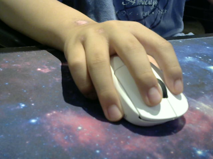
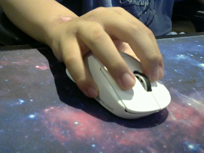
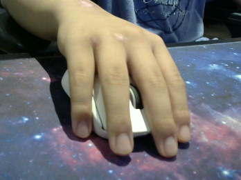

CPS is a term for how many times you can click per second. You may be wondering why this matters. This matters because if you click slower you will take more knockback in pvp and you will be faster and the reverse would be true as well so if you click faster you would move slower and take less knockback. There are three main clicking methods that people use for pvp, these three being jitter, butterfly, and normal clicking.  The first method I will be covering is normal clicking; this is where you would normally click your mouse. You would be holding your mouse like this:

You will not get crazy high clicks as I personally get 5-7, however there are some people that can reach 10 clicks per second. This clicking method is good if you are not proficient in the others or if you just want to prioritize control over clicks per second. 

The second method I will be covering is jitter clicking. Jitter clicking is where you start jittering your forearm so you can concentrate the fast movements into your hand where you rest your finger on the mouse button and start generating 12-16 cps. The way you hold your mouse can vary, however here is the most common way that people hold their mouse:

The reason why most people hold their mouse like this when they try to jitter click they use their pointer finger to actually generate the clicks, the middle finger to help control the pointer finger, the ring finger to be able to right click, and the thumb and pinky to be able to move around the mouse and aim. As a disclaimer this clicking method will show some of the best outcomes as the cps will be consistent however, your arm will get tired quickly if you try to click fast and it will be the hardest of the three methods to aim with.

The third and last clicking method is butterfly clicking. Butterfly clicking is where you use two fingers to click your mouse. There are two different types of butterfly clicking. The first way is by trying to just click as fast as possible. The second method is using double clicking. Double clicking is where you hit the mouse button in a certain way to register two clicks. DISCLAIMER: Not all mice will be able to double click. The way you would hold your mouse for butterfly clicking is like this:

Butterfly clicking is probably the best method as you can get the highest amount of clicks and have “alright” aim.
