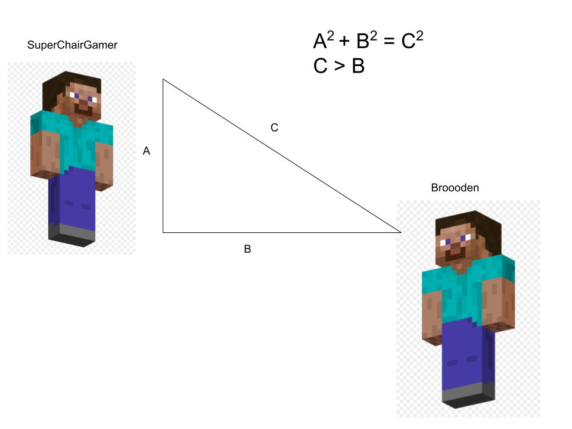

Chapter 2, Sprint Resetting:

If you run at someone holding W and then start clicking on them you will notice that you will start to deal less and less knockback each hit. Sprint resetting is a term, where after you hit someone you stop sprinting and then start sprinting again. The purpose of doing this is so that you can do as much knockback as possible to your opponent. The way this works is that after you hit someone for the maximum amount of knockback you can reset your sprint to do the same maximum amount of knockback. Now you may be wondering what is the point of this? There are two points to this the first one being: there are many pvp game modes that have a void such as bedwars or skywars and being able to hit the opponent for a lot of knockback would help you get the kill easier. The second reason is the reason why people can get 30+ hit combos(this is where you hit them 30 times without them hitting you once), when you hit people with a lot of knockback you will notice that they also move upwards. When you are moving upwards and backwards at the same time  it is very difficult to hit the opponent because you are moving backwards so you are not in control of your movement. It is also very difficult to hit people when you are hit up or above them because of the Pythagorean Theorem which suggests that hypotenus is always the longest side, this only works because reach or how far you can hit your; opponent from the head of a player. Since the base of a right triangle is shorter than the hypotenuse hitting from below or not having knockback would be beneficial. Here is an image to represent the reach difference:

                                    
In the example above ⬆️ “Broooden” would have the advantage as he does not need to reach as much as “SuperChairGamer”, so “Broooden” could likely start a combo on his opponent.
